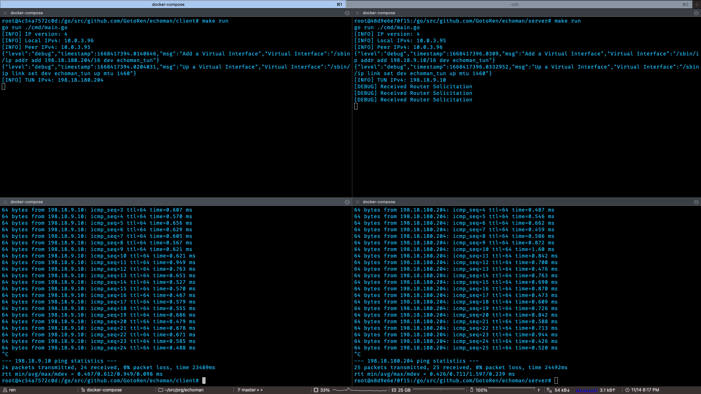
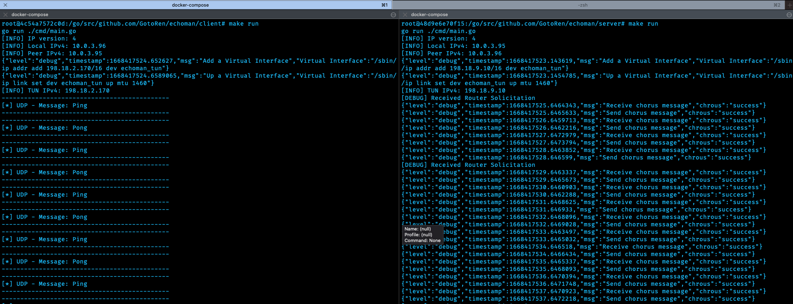

# Information: Network design

## Default Information

- Real Network range: `10.0.3.0/22` / `fde4:db8::/8`
- Overlay Network range: `198.18.0.0/16` / `2001:0db8:c0ff:ee00::/64`

| Device | Information |
| :--- | ---: |
| Echoman Server IPv4 address | `10.0.3.95/22` |
| Echoman Server IPv6 address | `fde4:db8::0395/8` |
| Echoman Server UDP connection port  | `30000` |
| Echoman Server TUN/TAP interface name | `echoman_tun` |
| Echoman Server Virtual IPv4 address | `198.18.9.10/16` |
| Echoman Server Virtual IPv6 address | `2001:db8:c0ff:ee00:0910:0910:0910:0910/64` |

| Device | Information |
| :--- | ---: |
| Echoman Client IPv4 address | `10.0.3.96/22` |
| Echoman Client IPv4 address | `fde4:db8::0396/8` |
| Echoman Client UDP connection port  | `30000` |
| Echoman Client TUN/TAP interface name | `echoman_tun` |
| Echoman Client Virtual IPv4 address | `198.18.x.x/16` |
| Echoman Client Virtual IPv6 address | `2001:db8:c0ff:ee00:xxxx:xxxx:xxxx:xxxx/64` |

## TUN/TAP を介したecho
- ICMPv4

- UDPv4

