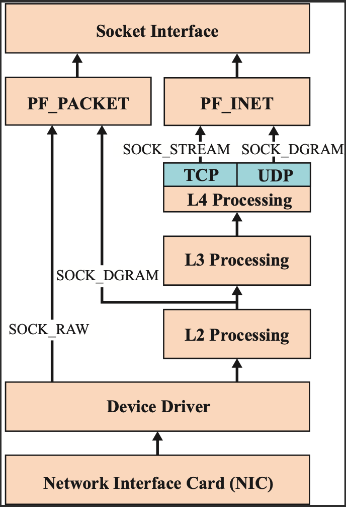

# Appendix: About sockets

## Standard socket / Raw socket


- ソケット関数

| args | syscall |
| :--- | :---: |
| Domain | `AF_PACKET` | 
| Type | `SOCK_RAW` | 
| Protocols | `IPPROTO_RAW` | 

- L3~ をRawsocketで操作
```go
// ### 送信ソケットの生成
func SendIPv4RawSocket(dip string) (int, error) {
	fd, err := syscall.Socket(syscall.AF_INET, syscall.SOCK_RAW, syscall.IPPROTO_RAW)
	if err != nil {
		return -1, err
	}

	ip := net.ParseIP(dip)
	addr := syscall.SockaddrInet4{
		Addr: [4]byte{ip[0], ip[1], ip[2], ip[3]},
	}

	if err = syscall.Bind(fd, &addr); err != nil {
		return -1, err
	}

	return fd, nil
}

// 受信ソケットの生成
func RecvIPv4RawSocket(sip string) (int, error) {
	fd, err := syscall.Socket(syscall.AF_INET, syscall.SOCK_RAW, syscall.IPPROTO_RAW)
	if err != nil {
		return -1, err
	}

	ip := net.ParseIP(sip)
	addr := syscall.SockaddrInet4{
		Addr: [4]byte{ip[0], ip[1], ip[2], ip[3]},
	}

	if err = syscall.Bind(fd, &addr); err != nil {
		return -1, err
	}

	return fd, nil
}

// IPv4パケット（L3~）の送信
func SendPacket4(fd int, b []byte, dip []byte) error {
	addr := syscall.SockaddrInet4{
		Addr: [4]byte{dip[0], dip[1], dip[2], dip[3]},
	}

	if err := syscall.Sendto(fd, b, 0, &addr); err != nil {
		return err
	}

	return nil
}
```
